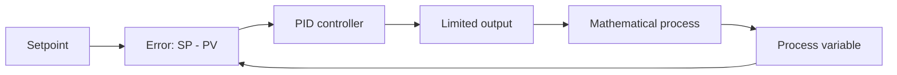
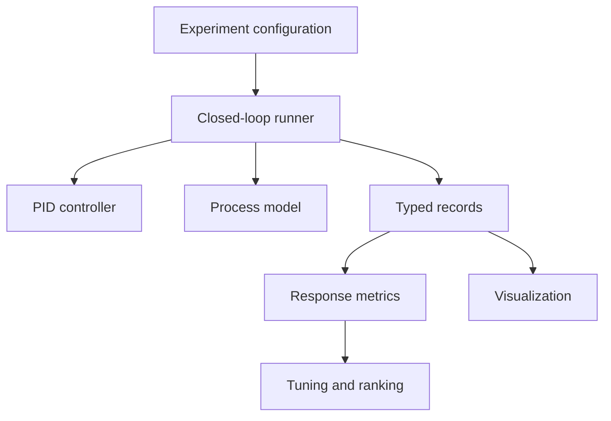
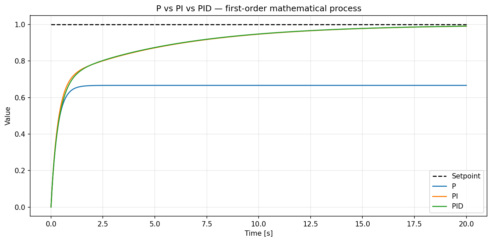

# Python PID Controller

[](https://github.com/ArungIW2/PID-Controller-Python/actions/workflows/ci.yml)
[](https://www.python.org/)
[](LICENSE)

A software-only, from-first-principles PID controller for learning feedback
control, discrete implementation, response analysis, tuning, and Python
engineering. The project was built as an engineering portfolio for a career
path from production operations toward Automation/PLC Engineering.

The repository deliberately avoids PID libraries as its controller
implementation. NumPy, Pandas, and Matplotlib support analysis and
visualization; they do not hide the control algorithm.

> This is educational control software. It has not been tested on an industrial
> machine, PLC, actuator, or safety system and must not be represented as such.

## Capabilities

- P, PI, PD, and PID behavior through independently configurable gains
- Fixed, validated sample time and deterministic reset
- Derivative-on-measurement or derivative-on-error
- First-order derivative filtering
- Output and integral limits
- Integral clamping and back-calculation anti-windup
- Manual/automatic modes with bumpless return to automatic
- Setpoint schedules and a first-order mathematical process model
- Typed time-series records, Pandas conversion, and CSV export
- Rise time, settling time, overshoot, peak, final error, IAE, and ISE
- Response, output, error, PID-term, and comparison plots
- Reproducible gain sweeps and P/PI/PID experiments
- Bounded parameter-grid tuning and model-parameter robustness studies
- Transparent Ziegler–Nichols gain conversion when valid `Ku` and `Pu` exist
- Automated tests, coverage enforcement, Ruff, strict Mypy, and multi-version CI

## Control loop



The continuous reference equation is:

```math
u(t) = K_p e(t) + K_i \int e(t)\,dt + K_d \frac{de(t)}{dt}
```

The actual code uses documented discrete-time equations. See
[PID theory](docs/pid-theory.md) for integral, derivative, filtering,
saturation, anti-windup, and bumpless-transfer decisions.

## Mathematical process model

The default process is the stable first-order equation:

```math
\frac{dy}{dt} = \frac{K u - y}{\tau}
```

It is integrated with forward Euler at the controller sample time. This model
is intentionally compact: it exposes controller behavior without pretending to
be a digital twin or hardware simulation.

## Architecture



Controller arithmetic is independent from process dynamics, orchestration,
Pandas, plotting, and tuning. Detailed responsibilities and dependency rules
are in [architecture.md](docs/architecture.md).

## Installation

Python 3.10 or newer is required.

```bash
git clone https://github.com/ArungIW2/PID-Controller-Python.git
cd PID-Controller-Python
python -m venv .venv
python -m pip install --upgrade pip
python -m pip install -e ".[dev]"
```

Activate the virtual environment using the command appropriate for your shell.

## Basic usage

```python
from pid_controller import (
    FirstOrderProcess,
    PIDConfig,
    PIDController,
    calculate_metrics,
    run_closed_loop,
)

controller = PIDController(
    PIDConfig(
        kp=2.0,
        ki=0.5,
        kd=0.1,
        sample_time=0.05,
        output_limits=(0.0, 2.0),
        derivative_filter_tau=0.1,
    )
)

result = run_closed_loop(
    controller,
    FirstOrderProcess(),
    duration=20.0,
    setpoint=1.0,
)

print(calculate_metrics(result))
result.to_csv("results/basic-response.csv")
```

See [`examples/`](examples/) for basic simulation and tuning workflows.

## Curated comparison

The following P, PI, and PID responses use the same first-order process,
setpoint, duration, and sample time.



| Controller | Rise time | Settling time | Overshoot | Final error | IAE |
| --- | ---: | ---: | ---: | ---: | ---: |
| P | Not reached | Not settled | 0.00% | 0.3333 | 6.8722 |
| PI | 6.35 s | 15.55 s | 0.00% | 0.0091 | 1.9235 |
| PID | 6.25 s | 15.40 s | 0.00% | 0.0088 | 1.9255 |

These values are properties of the declared mathematical scenario, not machine
performance claims. Regenerate the plot and source CSV with:

```bash
python scripts/generate_release_assets.py
```

## Experiments

```bash
python experiments/proportional/run.py
python experiments/integral/run.py
python experiments/derivative/run.py
python experiments/pid/run.py
```

Each experiment writes trace CSVs, a metric summary, a configuration manifest,
and a comparison plot under `results/`. See
[experiments.md](docs/experiments.md) for interpretation rules.

## Tuning

The project supports three deliberately distinct approaches:

1. Manual tuning for understanding controller effects.
2. Bounded parameter sweep with explicit cost weights.
3. Classic closed-loop Ziegler–Nichols gain conversion only when legitimate
   ultimate gain and period measurements already exist.

The stable first-order model without delay is not forced into an invalid
ultimate-oscillation exercise. See [tuning.md](docs/tuning.md) for assumptions,
trade-offs, and robustness evaluation.

## Testing and quality

```bash
python -m pytest
python -m ruff check .
python -m mypy src
python -m build
```

The test suite covers controller calculations, validation, state reset,
derivative behavior, saturation, anti-windup, mode transfer, process equations,
simulation ordering, metrics, export, plots, experiments, tuning, and edge
cases. CI runs on Python 3.10, 3.11, and 3.12.

## Repository structure

```text
src/pid_controller/    Controller, model, simulation, metrics, plots, tuning
tests/                 Unit and integration tests
examples/              Minimal public-API workflows
experiments/           Reproducible Kp, Ki, Kd, and controller comparisons
docs/                  Theory, architecture, experiments, tuning, release notes
scripts/               Curated documentation-asset generation
results/               Generated local artifacts, ignored by default
```

## Limitations

- Not a real-time runtime, PLC emulator, safety controller, or certified library.
- No hardware, actuator, sensor, motor, communication network, or scan-cycle
  timing is represented.
- The first-order model omits delay, nonlinearities, measurement noise, and
  actuator dynamics unless a future scenario introduces them explicitly.
- Tuning results depend on model, command, constraints, metric definitions, and
  objective weights.
- A strong software result does not replace commissioning and validation on a
  real target system.

## Documentation

- [Requirements and scope](docs/requirements.md)
- [Architecture](docs/architecture.md)
- [PID theory](docs/pid-theory.md)
- [Experiments](docs/experiments.md)
- [Tuning](docs/tuning.md)
- [Development roadmap](docs/roadmap.md)
- [Release checklist](docs/release-checklist.md)
- [Changelog](CHANGELOG.md)

## License

Released under the [MIT License](LICENSE).
