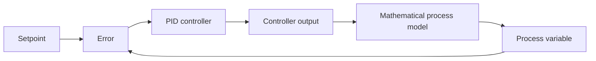

# Python PID Controller

[](https://github.com/ArungIW2/PID-Controller-Python/actions/workflows/ci.yml)
[](https://www.python.org/)
[](LICENSE)

An educational, software-only implementation of feedback control and PID
control in Python. The project is designed as an engineering portfolio project:
the controller algorithm is implemented from first principles, exercised
against a mathematical process model, measured with control-response metrics,
and protected by automated tests.

> **Project status:** Phase 1 of 10 — repository foundation. The PID algorithm
> is intentionally not implemented yet. See the [roadmap](docs/roadmap.md).

## Motivation

This repository supports a learning path from production operations toward
Automation/PLC Engineering. It focuses on the transferable ideas behind PID
control—feedback, discrete-time implementation, saturation, windup, tuning,
and response analysis—before those ideas are applied to a particular PLC or
industrial platform.

This project does **not** use or emulate physical hardware, and its future
results must not be interpreted as tests on a real machine or industrial
process.

## Planned control law

The continuous-time reference equation is:

\[
u(t) = K_p e(t) + K_i \int e(t)\,dt + K_d \frac{de(t)}{dt}
\]

where \(e(t) = SP(t) - PV(t)\). The implementation will use an explicit,
documented discrete-time form suitable for deterministic software tests.

## Planned closed loop



The initial model will be a first-order linear process:

\[
\frac{dy}{dt} = \frac{K u - y}{\tau}
\]

It is a mathematical teaching model, not a digital twin or hardware
simulation. The choice and limitations are documented in
[requirements and scope](docs/requirements.md).

## Architecture

The target architecture separates controller logic, process dynamics,
simulation orchestration, metrics, visualization, and experiments. This keeps
the controller independently testable and prevents plotting or file I/O from
leaking into the control algorithm.

See [architecture.md](docs/architecture.md) for module responsibilities and
dependency rules.

## Installation

Phase 1 requires Python 3.10 or newer.

```bash
git clone https://github.com/ArungIW2/PID-Controller-Python.git
cd PID-Controller-Python
python -m venv .venv
```

Activate the virtual environment, then install the project and development
tools:

```bash
python -m pip install --upgrade pip
python -m pip install -e ".[dev]"
```

## Usage

There is no controller API in Phase 1. A runnable example will arrive with the
first controller increment. This status is explicit so that repository users
do not mistake scaffolding for a validated control implementation.

## Testing and quality

Run the current checks locally:

```bash
python -m pytest
python -m ruff check .
python -m mypy src
```

GitHub Actions runs the same checks on Python 3.10, 3.11, and 3.12. Tests will
be added in the same phase as each behavior they verify.

## Experiments and results

Planned reproducible experiments compare:

- multiple proportional gains;
- multiple integral gains and windup behavior;
- multiple derivative gains and damping;
- P, PI, and PID controllers under the same model and scenario;
- selected manual, rule-based, and parameter-sweep tuning approaches.

Generated plots and CSV files belong in `results/` and are ignored by Git by
default. Curated release results may be committed deliberately with their
configuration and provenance.

## Response metrics

The planned analysis includes rise time, settling time, overshoot, peak value,
steady-state error, Integral Absolute Error (IAE), and Integral Squared Error
(ISE). Metric definitions and edge-case behavior will be documented alongside
their implementation so comparisons remain meaningful.

## PID tuning

Tuning work is scheduled after the core controller, model, simulation runner,
and metrics are verified. The project will compare manual tuning, an applicable
rule-based method, and parameter sweep. Ziegler–Nichols will only be included
when its assumptions and limitations can be demonstrated honestly for the
chosen model.

## Limitations

- The project is educational software, not a safety-certified controller.
- The mathematical model does not reproduce all nonlinearities, delays,
  disturbances, noise, or constraints of an industrial process.
- Results from the mathematical model are not evidence of performance on real
  equipment.
- Real-time scheduling and PLC scan-cycle behavior are outside the initial
  scope.

## Future development

The ten-phase delivery plan covers P, PI, PD/PID, process modelling,
anti-windup, filtering, metrics, experiments, tuning, and a portfolio release.
Every phase has an acceptance criterion and proposed commit boundary in
[roadmap.md](docs/roadmap.md).

## License

Released under the [MIT License](LICENSE).
