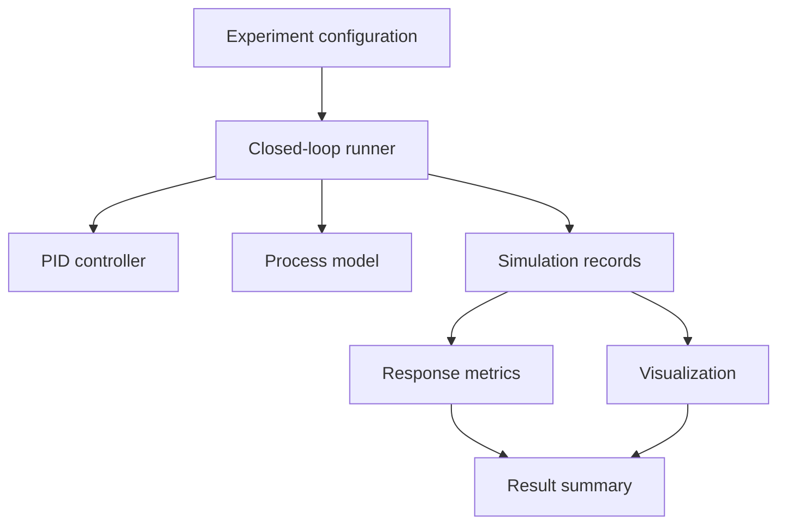

# Software Architecture

## Design goals

The design uses a small functional core with explicit state. The controller
must not know which mathematical model, logger, plotter, or experiment invokes
it. This allows calculations to be tested directly and reused later without a
large framework.

## Target component view



## Planned package structure

```text
src/pid_controller/
├── __init__.py       # Deliberate public API
├── controller.py     # PID configuration, state, and update calculation
├── models.py         # Mathematical process model protocols and implementations
├── simulation.py     # Closed-loop time stepping and scenario execution
├── metrics.py        # Response-quality metrics
├── logging.py        # Typed simulation records and tabular conversion
├── visualization.py  # Plot creation from records
├── tuning.py         # Tuning and parameter-search strategies
└── exceptions.py     # Domain-specific validation errors
```

Modules will be added only when their phase begins; the tree above is a design
contract, not an excuse to create empty files.

## Responsibility boundaries

| Component | Owns | Must not own |
| --- | --- | --- |
| Controller | Gains, state, PID terms, limiting, reset | Plotting, process dynamics, CSV I/O |
| Process model | Mathematical state transition | Controller tuning or metrics |
| Runner | Clock, setpoint schedule, controller/model coordination | PID arithmetic |
| Records | Immutable samples and conversion | Simulation decisions |
| Metrics | Definitions and calculations on recorded series | Running the loop |
| Visualization | Figures from records | Recalculating control behavior |
| Tuning | Candidate generation and scoring | Hidden changes to model/scenario |

## Proposed controller API

The exact names may evolve with tests, but the intended boundary is:

```python
config = PIDConfig(kp=2.0, ki=0.5, kd=0.1, sample_time=0.1)
controller = PIDController(config)
sample = controller.update(setpoint=1.0, measurement=0.2)
controller.reset()
```

`update` will return a typed sample containing the error, individual P/I/D
terms, unclamped output, and final output. Returning observability data avoids
duplicating private controller equations in loggers and experiments.

## Discrete-time decisions

- Integral: rectangular accumulation, \(I_k = I_{k-1} + K_i e_k\Delta t\).
- Derivative: difference quotient, initially on error for teaching, then
  derivative-on-measurement as the practical default before advanced studies.
- Initial derivative: zero on the first update because no previous sample exists.
- Timing: fixed configured sample time in the deterministic simulation path.
- Numeric policy: reject NaN and infinity at public numeric boundaries.

Each decision will be encoded in tests before it is considered stable.

## Data flow

1. The runner obtains the current setpoint and process variable.
2. The controller calculates a typed control sample.
3. The runner passes the limited output to the mathematical model.
4. The model advances one discrete step.
5. The runner stores one immutable record.
6. Analysis and visualization consume completed records after the run.

## Dependency rule

Dependencies point inward toward domain calculations. Matplotlib and Pandas
must never be required to import or execute the controller core. NumPy may be
used for array-oriented analysis, not for hiding the PID algorithm.

